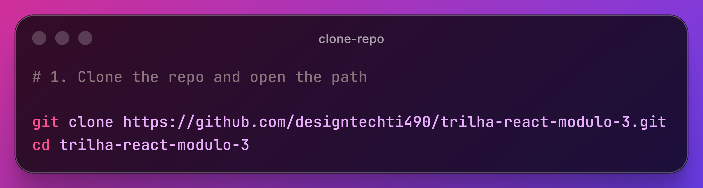
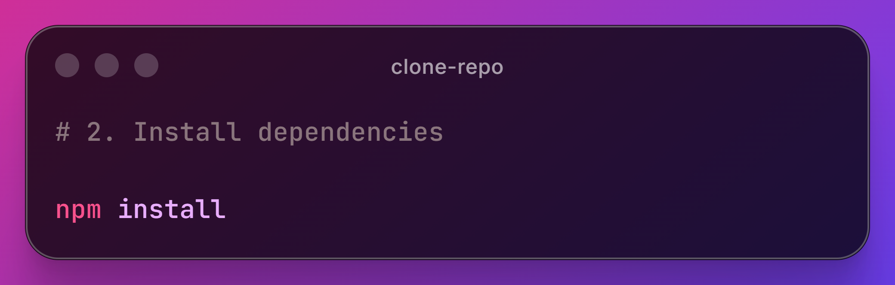
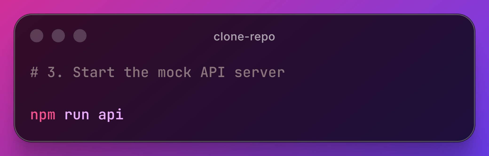
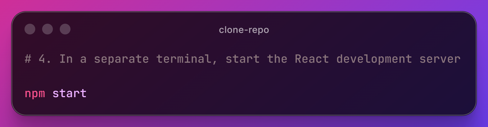

# ✨ DIO Clone

This project is a React-based clone of the DIO learning platform. It demonstrates user authentication, content feed presentation, form validation, API integration via a local JSON server, and responsive UI components built with styled-components.

## 🛠️ Features

- Login screen with form validation using `react-hook-form` and `yup`
- Protected feed page that loads user data and posts from a mock API
- Reusable components for buttons, inputs, cards, and header layout
- Local JSON server for API data simulation with `json-server`
- Styled UI with `styled-components`
- Client-side routing using `react-router-dom`

## ⚡ Technologies Used

&nbsp;
&nbsp;
&nbsp;

## 🚀 How to Clone and Run the Project

1. Clone the repository:

2. Install dependencies:

3. Start the mock API server:

4. In a separate terminal, start the React development server:

## 🌐 View on hosting link

Check out the website by clicking here [DIO Clone](https://trilha-react-modulo-3.vercel.app/)

## Available Scripts

- `npm start` - Starts the React development server
- `npm run api` - Runs the JSON server using `db.json` on port `8001`
- `npm test` - Runs the test runner
- `npm run build` - Builds the production-ready React app

## Notes

- Ensure the API server is running before using the app so the feed and user data load correctly.
- Adjust the mock data in `db.json` if you want to modify the API responses.

## 👤 Author

<table width="100%">

<tr>

<td align="center">

<a href="https://github.com/designtechti490">

 

<b>Marcelo Junior</b>
          <i>Front End Developer</i>

</a>

</td>

</tr>

</table>

---

 Developed with 💜 during the React trail at Digital Innovation One. 

